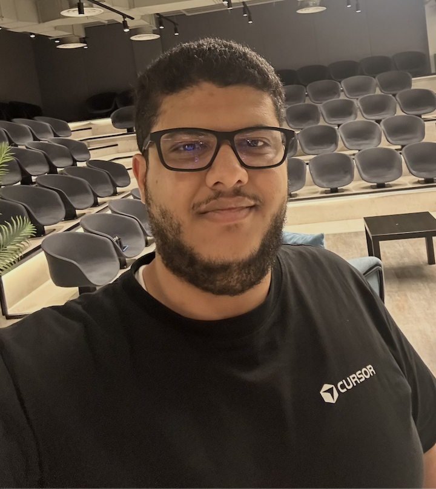

# PixelForge MCP — Demo Slides

Presentation slides for the **PixelForge MCP** live demo at [Vibe Code Atelier](https://luma.com/ah0iu2db) #4 — a community meetup series in Tallinn for AI builders to share projects and ideas.

**[View Slides →](https://ahmed-aleryani.github.io/pixelforge-slides/)**

## About the Talk

Claude Code is powerful at reasoning and shipping code — but it's completely blind. It can't generate images, analyze screenshots, or extract colors. **PixelForge MCP** bridges that gap by giving any MCP-compatible AI client (Claude Code, Cursor, VS Code, Windsurf, Kiro, Claude Desktop) the ability to generate, edit, and analyze images using Google's Gemini models.

This 8-minute talk covers the problem, the MCP protocol, and a live demo of image generation, editing, panoramic rendering, and AI-powered image analysis — all from the terminal.

## Speaker

  
   
  <strong>Ahmed Al-Eryani</strong>

### Connect on LinkedIn

[linkedin.com/in/ahmed-aleryani](https://www.linkedin.com/in/ahmed-aleryani)

### Install

[pypi.org/project/pixelforge-mcp](https://pypi.org/project/pixelforge-mcp/)

## Event Details

- **Event:** Vibe Code Atelier #4 — Demo Day
- **Venue:** [LIFT99](https://www.lift99.co/tallinn-hub), Tallinn
- **Date:** March 5, 2026

## Source

**[GitHub →](https://github.com/Tehnolabs/pixelforge-mcp)**
